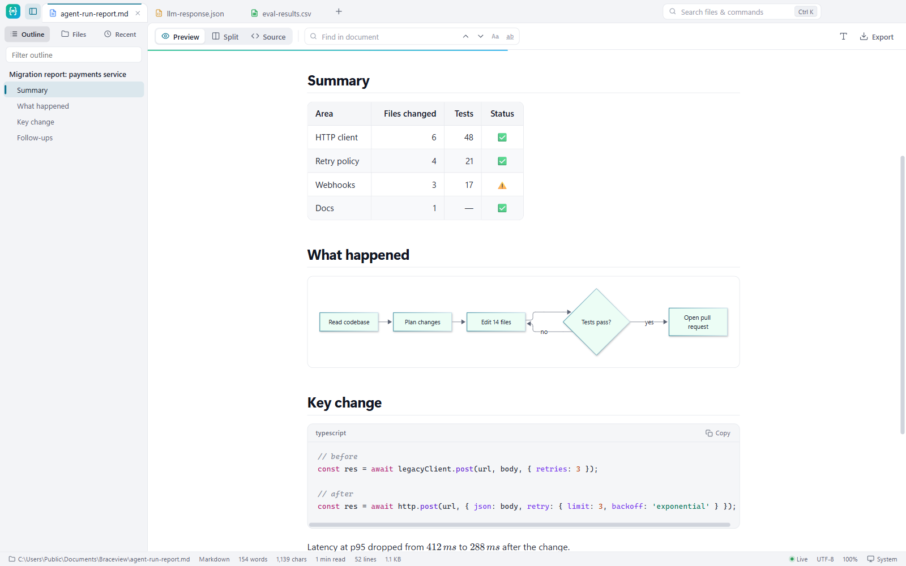
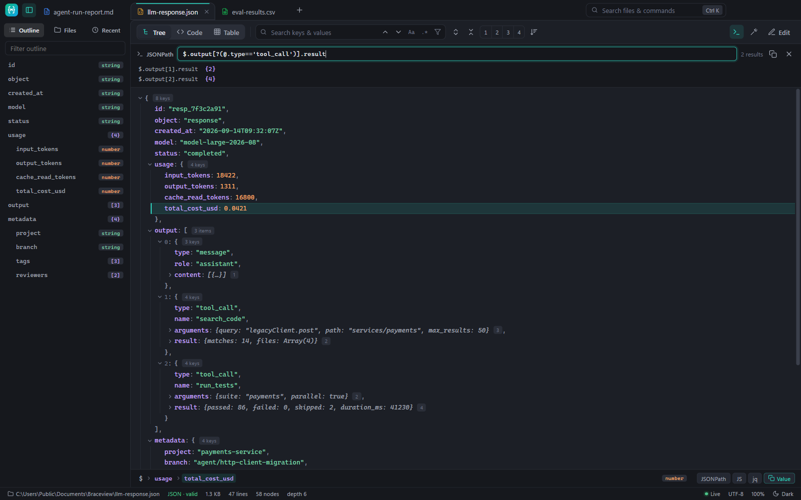
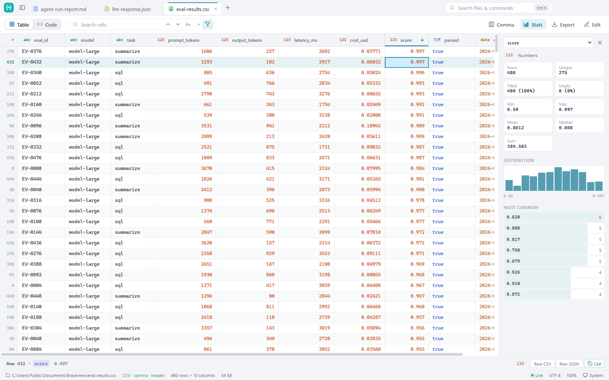
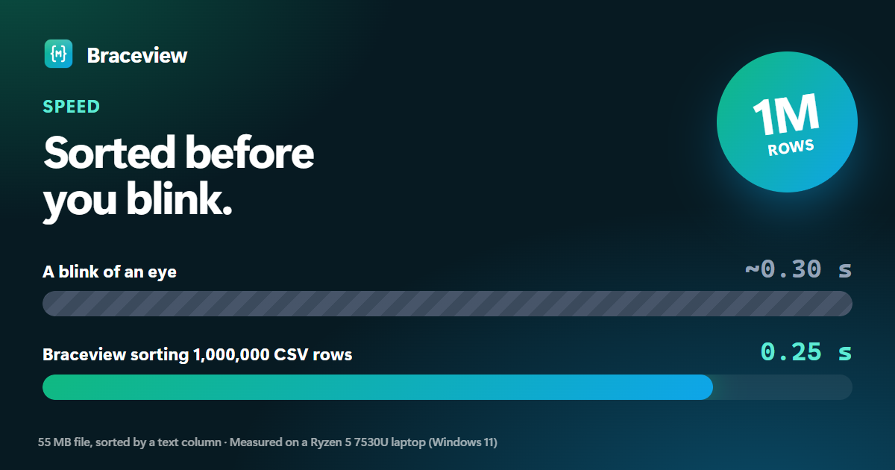

# Braceview

**Read JSON, CSV and Markdown in a click — on Windows, Mac and in Chrome.**

A small, fast, private viewer for the files AI tools and APIs produce.

[**Website**](https://viveksthul15.github.io/braceview/) · [**Download**](https://github.com/viveksthul15/braceview/releases/latest) · [Report a bug](https://github.com/viveksthul15/braceview/issues/new/choose) · [Privacy](https://viveksthul15.github.io/braceview/privacy.html)

## Download

| Platform | File | Notes |
| --- | --- | --- |
| **Windows 10 / 11** | `Braceview-Setup-<version>.exe` | Adds Braceview to “Open with” for JSON, Markdown and CSV |
| Windows, no install | `Braceview-Portable-<version>.exe` | Runs from anywhere |
| **macOS (Apple Silicon)** | `Braceview-<version>-mac-arm64.dmg` | M1, M2, M3, M4 |
| macOS (Intel) | `Braceview-<version>-mac-x64.dmg` | |
| **Chrome / Edge** | `braceview-extension-<version>.zip` | Store listing coming soon — [install steps](#chrome-and-edge-extension) |

Get them from the [latest release](https://github.com/viveksthul15/braceview/releases/latest). Each release lists SHA-256 checksums.

### First launch

- **Windows:** the installer isn't code-signed yet, so SmartScreen may say “Windows protected your PC”. Click **More info → Run anyway**.
- **macOS:** the app isn't notarized yet. Open it once, click **Done** on the warning, then go to **System Settings → Privacy & Security** and click **Open Anyway**.

### Open files with a double-click

- **Windows:** right-click a `.json`, `.md` or `.csv` file → **Open with → Choose another app → Braceview** → tick **Always**.
- **macOS:** right-click a file → **Get Info → Open with → Braceview → Change All**.

### Chrome and Edge extension

1. Unzip `braceview-extension-<version>.zip` to a folder you'll keep.
2. Open `chrome://extensions` (or `edge://extensions`) and switch on **Developer mode**.
3. Click **Load unpacked** and pick the folder.
4. For local files, open **Details** and enable **Allow access to file URLs**.

## What it does

**JSON** — tree view with search and filter, JSONPath queries, copy any path as JSONPath / JS / jq, table view for arrays, code view with folding. Handles JSON with comments and JSON Lines.

**CSV** — a table that sorts a million rows in a quarter of a second. Sort, search and filter; column statistics with a distribution chart; export what you see as JSON, Markdown or CSV. Detects delimiters, header rows and decimal commas; opens old Excel exports with the right characters.

**Markdown** — diagrams (Mermaid), math, tables, task lists and GitHub alerts rendered properly, with an outline that follows your reading position, split editing, and export to PDF or HTML.

**In the browser** — API responses open as a searchable tree, raw GitHub `.md` and `.csv` files render instantly, and JSON inside documentation pages gets a **View as tree** button.

**Everywhere** — tabs, command palette (`Ctrl/Cmd+K`), light and dark themes, auto-reload when a file changes, keyboard shortcuts for everything.

## Speed

Measured on an everyday Ryzen 5 laptop. Full method and results: [BENCHMARKS.md](BENCHMARKS.md).

| | |
| --- | --- |
| Sort a million CSV rows (55 MB) | **0.25 s** — faster than a blink |
| Column statistics on a million rows | **0.35 s** |
| Double-click to a 20 MB JSON tree | **1.8 s**, including app start |
| CPU while it sits open | **~0%** |
| Extension code on pages that aren't JSON, CSV or Markdown | **4.7 KB** |

## Privacy

Braceview has no accounts, analytics or telemetry, and never uploads your files or the pages you view. Read the [privacy policy](https://viveksthul15.github.io/braceview/privacy.html).

## Feedback

Found a bug or want a file type supported? [Open an issue](https://github.com/viveksthul15/braceview/issues/new/choose).

---

© 2026 Vivek Sthul. Braceview is free to use. See [CHANGELOG](CHANGELOG.md) for release history.
